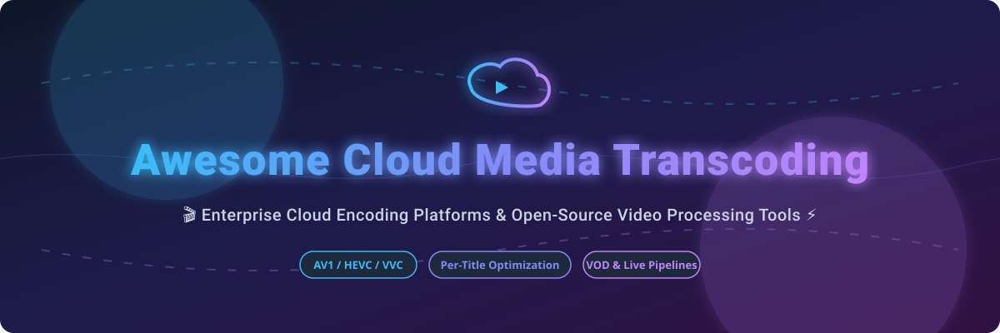

# Awesome-Cloud-Media-Transcoding 🎬 ⚡

  

  
  
  
  
  
  

---

## 🌟 Top Cloud Media Transcoding Ecosystem & Video Processing Tools

**Curated List of Commercial Cloud Encoding Platforms & Open-Source Transcoding Tools**  

*Focused on VOD/Live Encoding, Per-Title Optimization, Hardware Acceleration, Codec Efficiency & Self-Hosted Streaming Pipelines* 🚀

**Last updated: October 2026** 📅

---

### 📌 Overview & SEO Summary 🔍

Welcome to the ultimate curated directory of **cloud media transcoding platforms**, **open-source video processing frameworks**, **video encoding APIs**, **FFmpeg wrappers**, and **streaming pipeline tools**. Whether you are building an enterprise streaming service requiring scalable VOD/Live video encoding (such as *AWS Elemental MediaConvert*, *Bitmovin*, *Telestream Cloud*, and *Mux Video*), or self-hostable open-source video transcoders (like *HandBrake*, *FFmpeg*, *Kyoo/Gocoder*, *Bento4*, and *Stellar-Engine*), this comprehensive guide covers industry leaders, codec efficiency comparisons (AV1 vs HEVC vs H.264), per-title encoding optimization, hardware acceleration (NVENC, VAAPI, QSV), and cost reduction strategies for video streaming pipelines.

**Key Market & Technical Insights:** 💡

- 📈 **Market Size & Structure**: The global cloud video transcoding market size is estimated at **$1.8 Billion - $2.5 Billion** and is **moderately fragmented**, balancing dominant cloud hyperscalers (AWS, Google Cloud) with specialized high-efficiency encoding vendors (Bitmovin, Telestream, Mux).
- ⚠️ **Amazon Elastic Transcoder reaches End of Support on November 13, 2025** — existing customers must migrate to AWS Elemental MediaConvert.
- ⚡ **Codec Efficiency Drives Major Cost Differences**: Bitmovin benchmarks show **HEVC at 0.67x bitrate of AVC (H.264)**, **AV1 at 0.55x**, and **VVC at 0.4x** — delivering up to **60% bandwidth cost savings** for high-resolution video streams.
- 🎯 **Per-Title Encoding**: Dynamically tailors the bitrate ladder to content complexity, reducing storage and CDN egress costs by **30–50%**.

---

## 📑 Table of Contents

- [🏢 SaaS & Commercial Platforms](#-saas--commercial-platforms)
- [🔓 Open-Source GitHub Projects](#-open-source-github-projects)
- [🛠️ How to Contribute](#%EF%B8%8F-how-to-contribute)
- [📊 Star History](#-star-history)
- [🤝 Support & Sponsorship](#-support--sponsorship)
- [⚠️ Disclaimer](#%EF%B8%8F-disclaimer)

---

## 🏢 SaaS / Commercial Platforms 💼

The cloud video transcoding sector is estimated at **$1.8B - $2.5B in market size** and is **moderately fragmented**, driven by competing demands between infrastructure hyperscalers and specialized developer API providers.

| SaaS / Commercial Platform | Company / Owner | Market Size / Valuation | Standard Edition Starting Price | Free Tier / Free Trial Limits | Description |
| :--- | :--- | :--- | :--- | :--- | :--- |
| **[AWS Elemental MediaConvert](https://aws.amazon.com/mediaconvert/)** ☁️ | Amazon | ~$2.0 Trillion Market Cap | **$0.0075/min (SD Basic)**; **$0.015/min (HD Basic)**; **$0.042/min (HD Professional)** | **20 minutes/month free for 12 months** (AWS Free Tier) | **AWS-native broadcast-grade video processing** — Scalable pay-as-you-go VOD encoding with multi-codec support (AVC, HEVC, AV1, Apple ProRes), QVBR rate control, dynamic graphic overlay, and Dolby Vision HDR metadata support. |
| **[Fastly Media Shield & Edge](https://www.fastly.com/)** 🌐 | Fastly | ~$1.2 Billion Market Cap | **$0.12/GB bandwidth** (North America starting rate) | **$50/month free credit for 1 month trial** | **Edge video delivery & dynamic packaging** — High-performance edge compute platform providing live stream dynamic packaging, HLS/DASH manifest manipulation, and origin shield media caching. |
| **[Dolby.io Media Processing](https://dolby.io/)** 🔊 | Dolby Laboratories | ~$7.5 Billion Market Cap | **$0.025/min (Audio enhancement)**; **$0.05/min (Transcoding)** | **$50 free credit upon signup** (No expiration) | **Premium audio & video enhancement APIs** — Broadcast-quality spatial audio processing, Dolby Atmos rendering, Dolby Vision color mastering, automated noise reduction, and loudness normalization. |
| **[Brightcove (Zencoder)](https://www.brightcove.com/)** 📺 | Brightcove | ~$500 Million Valuation | **$0.05/min (Pay-as-you-go)**; **$0.02/min (Volume commitment)** | **100 free video encodes trial** (First month) | **Enterprise video cloud & Zencoder API** — Battle-tested VOD transcoding service supporting ultra-fast parallel encoding, DRM encryption (Widevine, FairPlay), dynamic ad insertion (CSAI/SSAI), and multi-CDN distribution. |
| **[Bitmovin Cloud Encoding](https://bitmovin.com/)** 🎬 | Bitmovin | ~$250 Million Valuation | **$0.015/min (SD)**; **$0.03/min (HD H.264)**; **2x multiplier for HEVC / 4x for 4K** | **90-day free trial with 10,000 encoding minutes** | **Codec efficiency & Per-Title encoding leader** — Multi-cloud API encoder featuring Per-Title bitrate optimization, 100x real-time split-and-stitch parallel encoding, 8K/AV1 support, and SCTE-35 ad placement tagging. |
| **[Telestream Cloud](https://cloud.telestream.net/)** 📡 | Telestream | ~$400 Million Valuation | **$0.03/min (SD)**; **$0.06/min (HD)**; **$0.12/min (UHD/4K)** | **100 free encoding minutes trial** (14 days) | **Vantage workflow automation in the cloud** — Professional cloud media pipeline tool providing frame-accurate conversion, QC automated verification, Tachyon standards conversion, and closed caption processing. |
| **[Mux Video](https://www.mux.com/)** 🚀 | Mux | ~$300 Million Valuation | **$0.005/min (Basic encoding)**; **$0.001/min (Storage)**; **$0.001/min (Delivery)** | **$20 free credit + 100k delivery minutes/month** | **Developer-first video infrastructure API** — Instant video ingestion, dynamic HLS/DASH packaging, AI-driven per-title encoding, free basic quality encoding, built-in Mux Data monitoring, and global edge delivery. |
| **[Cloudinary](https://cloudinary.com/)** ☁️ | Cloudinary | ~$200 Million Valuation | **$89/month (Plus Plan)**; Credit system: 1 credit = 1,000 transformations or 1GB storage/bandwidth | **Free Forever: 25 credits/month (~25,000 transformations or 25GB bandwidth)** | **AI-powered video & image management** — Cloud media platform with smart auto-cropping, automatic format optimization (f_auto, q_auto), adaptive bitrate streaming, and real-time video transformations. |
| **[Qencode](https://cloud.qencode.com/)** ⚡ | Qencode | ~$50 Million Valuation | **$0.005/min (SD output)**; **$0.01/min (HD output)**; **$0.02/min (4K output)** | **500 free encoding minutes upon registration** | **Cost-optimized cloud video encoding** — High-speed parallel transcoding API with zero transfer fees, customized ABR ladders, AV1/HEVC encoding at low cost, and automated S3-compatible storage ingestion. |
| **[Amazon Elastic Transcoder](https://aws.amazon.com/elastictranscoder/)** ⚠️ | Amazon | ~$2.0 Trillion Market Cap | **End of Support: November 13, 2025** | **Service Discontinued (Migrate to MediaConvert)** | **Legacy AWS video transcoder (Discontinued)** — Deprecated cloud media transcoding service replaced by AWS Elemental MediaConvert. |

---

## 🔓 Open-Source GitHub Projects 🛠️

*Sorted by GitHub Stars_Count (Descending)* 🌟

- **[FFmpeg](https://github.com/FFmpeg/FFmpeg)**   
  **The universal cross-platform multimedia framework** — Complete open-source solution to record, convert, transcode, mux, demux, stream, filter, and play video and audio files. Supports virtually every video codec (H.264, HEVC, AV1, VP9, ProRes) and hardware acceleration APIs (NVENC, QuickSync, VAAPI, VideoToolbox). 🎥

- **[HandBrake](https://github.com/HandBrake/HandBrake)**   
  **Open-source video transcoder for multi-platform conversion** — Standalone desktop application and CLI tool for converting video from nearly any format to modern, widely supported codecs. Features built-in video presets, title/chapter selection, subtitle insertion, and hardware-accelerated video encoding. 🎛️

- **[Bento4](https://github.com/axiomatic-systems/Bento4)**   
  **Full-featured MP4 systems and C++ class library** — Tools and library for multiplexing, demultiplexing, packaging, encrypting, and inspecting MP4 streams for HLS and MPEG-DASH adaptive bitrate delivery (including Common Encryption CENC, DRM support). 📦

- **[Stellar-Engine](https://github.com/Stellar-Engine/Stellar-Engine)**   
  **High-performance distributed cloud video transcoding server** — Distributed media processing framework designed to scale FFmpeg jobs across Kubernetes clusters with parallel chunk-based encoding, job status queues, and microservice orchestration. ⚡

- **[Gocoder (Kyoo Transcoder)](https://github.com/zoriya/kyoo)**   
  **Lazy transcoding engine with HLS for self-hosted media servers** — Modern transcoder module for Kyoo media server featuring on-demand HLS segment generation, automatic bitrate switching, shared client stream multiplexing, and VAAPI/CUDA hardware acceleration. 🎬

- **[ei-media](https://github.com/ei-media/ei-media)**   
  **Minimal self-hosted media server with dynamic video transcoding** — Lightweight Python-based video streaming server designed for instant home network streaming, automatic format compatibility checks, NVENC GPU hardware offloading, and embedded web video player. 🏠

---

## 🛠️ How to Contribute 🤝

Contributions are welcome! Follow these steps to submit new cloud video transcoding platforms, open-source video libraries, or media processing tools:

1. 🍴 **Fork** the repository.
2. 📝 **Add/edit** entries in `README.md` maintaining table/list structure and formatting.
3. 🔗 Include project title, official website/GitHub link, exact Stars_Count, license, and brief SEO-rich description.
4. 🚀 Submit a **Pull Request** with a descriptive summary of your changes.

---

## 📊 Star History

---

## 🤝 Support & Sponsorship

If you find this cloud media transcoding directory useful for your video pipelines, please consider supporting the project:

- ⭐ **Star** this repository to increase its visibility on GitHub!
- 🔀 **Fork** and share with fellow video engineers, media developers, and open-source advocates.
- ☕ **Sponsor & Buy Me a Coffee**: Support ongoing open-source curation via the [GitHub Sponsor Dashboard](https://github.com/sponsors/ishandutta2007).

---

## ⚠️ Disclaimer ℹ️

- This directory is a **community-curated list** — provided for informational and research purposes only. ℹ️
- **Amazon Elastic Transcoder End of Support**: Officially reaches End of Support on **November 13, 2025** — active workloads must be migrated to **AWS Elemental MediaConvert**.
- **Codec & Resolution Pricing Variances**: Cloud video processing costs scale significantly by resolution and codec complexity. HEVC/AV1 encoding often incurs a **2x to 4x cost multiplier** per minute compared to standard H.264, though offset by **30–60% delivery bandwidth savings**.
- **Always benchmark encoding quality (VMAF / PSNR)**, latency, and egress costs against your production streaming requirements before choosing a commercial or open-source encoder. 🎬

---

  <b>Made with ❤️ for video engineers, streaming developers, and open-source media processing advocates.</b>

